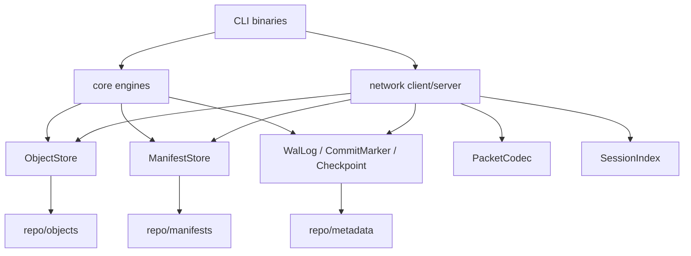

# cpp-data-protection-core

`cpp-data-protection-core` 是 Linux 上的 C++17 檔案備份核心。它提供 command-line tools，用於本機備份、還原、驗證、crash recovery、TCP client/server 上傳、benchmark、Docker demo 與 GitHub Actions 驗證。

目前專案沒有 Web UI、cloud service、Kubernetes、database backend、HTTP/gRPC API、authentication 或 encryption。未完成的項目列在 Known Limitations 與 Future Work。

## Project Scope

已實作的 binary：

| Binary | Purpose |
| --- | --- |
| `backupctl` | 本機 create/list/restore/verify/stats/recover/checkpoint/compact |
| `backup-client` | 將來源目錄切成 chunk，透過 TCP 傳給 server |
| `backup-server` | 接收 chunk，寫入 object store，建立 manifest 與 commit marker |
| `backup-bench` | 產生 workload，執行 backup/verify/restore，通過 correctness check 後輸出 metrics |
| `corrupt-repo` | 測試輔助工具；建置會產生，但 release artifact 不包含 |

已實作功能：

- fixed-size chunking 與簡化版 content-defined chunking (CDC)
- raw chunk SHA-256 content addressing
- zstd object compression
- manifest、object store、commit marker、checkpoint、WAL
- crash recovery 與 fault injection
- verify/restore checksum validation
- TCP binary protocol 與中斷後補傳
- malformed input 與 object corruption 測試
- Docker multi-stage build 與 Docker Compose demo
- GitHub Actions CI、sanitizer、Docker、release、CodeQL workflows

## Quick Start

Ubuntu 22.04/24.04：

```bash
sudo apt-get update
sudo apt-get install -y build-essential cmake ninja-build libssl-dev libzstd-dev libgtest-dev
./scripts/build.sh
./scripts/test.sh
```

建置產物位於：

```text
build/bin/backupctl
build/bin/backup-client
build/bin/backup-server
build/bin/backup-bench
build/bin/corrupt-repo
```

CLI help：

```bash
build/bin/backupctl --help
build/bin/backup-client --help
build/bin/backup-server --help
```

## Build And Test

一般建置：

```bash
./scripts/build.sh
```

指定 build directory 或 generator：

```bash
DPC_BUILD_DIR=/tmp/dpc-build CMAKE_GENERATOR=Ninja CMAKE_BUILD_TYPE=Debug ./scripts/build.sh
```

測試：

```bash
./scripts/test.sh
```

`scripts/test.sh` 會執行：

- CMake build
- GoogleTest unit tests
- integration backup/restore/verify test
- crash recovery fault injection test
- security malformed input shell test

成功輸出會包含：

```text
100% tests passed, 0 tests failed
security malformed input tests ok
```

## Local Backup Demo

```bash
./scripts/demo_local_backup.sh
```

此 demo 使用暫存目錄產生來源資料，執行 create/list/verify/restore，最後用 `diff -r` 比對來源與還原結果。成功輸出：

```text
local backup demo ok
```

## Crash Recovery Demo

```bash
./scripts/demo_crash_recovery.sh
```

此 demo 使用 `--fault-stage after-commit-marker` 模擬中斷，接著執行 `recover` 與 `verify`。成功輸出：

```text
crash recovery demo ok
```

## Client/Server Transfer Demo

```bash
./scripts/demo_client_server.sh
```

流程：

1. 建立暫存來源資料。
2. 背景啟動 `backup-server`。
3. 使用 `backup-client upload` 建立 version 1。
4. 使用 `--exit-after-chunks 10` 中斷一次上傳。
5. 使用相同 session id 再次上傳，server 回覆已收到 chunk，client 只補送缺少的 chunk。
6. 驗證 version 2，還原並執行 `diff -r`。

成功輸出：

```text
client/server demo ok
```

如果 port 19090 被占用：

```bash
DPC_DEMO_PORT=19190 ./scripts/demo_client_server.sh
```

## Benchmark Demo

```bash
./scripts/bench.sh
DPC_BENCH_SIZE=128M ./scripts/bench.sh
DPC_BENCH_CHUNKING=cdc ./scripts/bench.sh
```

直接執行 workload：

```bash
build/bin/backup-bench --workload large-file --size 64M --chunking fixed
build/bin/backup-bench --workload small-files --files 1000 --file-size 4096 --chunking fixed
build/bin/backup-bench --workload duplicated --size 64M --chunking fixed
build/bin/backup-bench --workload modified --base-size 64M --chunking cdc
```

`backup-bench` 會使用暫存目錄，自動產生資料，執行 backup、verify、restore，再比對 source 與 restore 的檔案清單和內容。correctness 通過後才輸出 metrics。

成功輸出包含：

```text
workload: large-file
chunking mode: fixed
total input size: 67108864
stored object size: 6523
dedup ratio: 1024.000
compression ratio: 0.000
backup throughput MB/s: 123.456
restore throughput MB/s: 456.789
verify throughput MB/s: 789.012
file count: 1
chunk count: 1024
unique chunk count: 1
duplicate chunk count: 1023
elapsed time: 0.123
```

數值會依硬體、OS page cache、compiler、輸入大小而變動；文件不宣稱固定性能比例。

## Interpreting Benchmark Results

`backup-bench` 的輸出先代表「這次實驗在目前環境中通過 correctness check」，再代表效能數字。若沒有成功完成 backup、verify、restore 與 source/restore 比對，程式會回傳 non-zero，不會輸出完整 metrics。

判讀時先看這些欄位：

| Metric | 如何解讀 |
| --- | --- |
| `workload` | 確認測的是哪種資料型態。`large-file` 偏向 sequential throughput，`small-files` 偏向檔案掃描與 metadata overhead，`duplicated` 偏向 dedup 行為，`modified` 適合比較 chunk boundary 變化 |
| `chunking mode` | `fixed` 是固定大小切塊，`cdc` 是簡化 content-defined chunking。兩者應在相同 workload、相同機器、相同 binary 下比較 |
| `total input size` | 原始輸入資料總量。throughput 與 compression ratio 都以此為基準 |
| `stored object size` | 實際寫入 `repo/objects` 的壓縮後 unique object bytes。此值不包含 manifest、WAL、checkpoint 等 metadata |
| `dedup ratio` | `chunk count / unique chunk count`。越高代表越多 chunk reference 重複指向既有 object；`1.000` 代表沒有 chunk-level dedup |
| `compression ratio` | `stored object size / total input size`。越低代表壓縮與 dedup 後的 object bytes 越少，但這不是完整 repository size |
| `backup throughput MB/s` | backup 階段處理 input MiB 的速度，受 chunking、hash、compression、filesystem write 影響 |
| `restore throughput MB/s` | restore 階段從 object store 解壓並重建檔案的速度 |
| `verify throughput MB/s` | verify 階段讀取 object、解壓、重算 checksum 的速度 |
| `chunk count` | manifest 中 chunk reference 總數。chunk 越小，通常 reference 越多，metadata 與 loop overhead 也越高 |
| `unique chunk count` | 實際存入 object store 的 unique chunk 數。dedup 是否有效主要看它和 `chunk count` 的差距 |
| `duplicate chunk count` | `chunk count - unique chunk count`。此值越高，代表越多 chunk 被 dedup |
| `elapsed time` | backup、verify、restore 三段加總時間，適合觀察端到端 demo 成本，不等同單一操作 throughput |

範例判讀：

```text
chunk count: 1024
unique chunk count: 1
duplicate chunk count: 1023
dedup ratio: 1024.000
```

這表示 workload 產生了 1024 個 chunk reference，但內容相同的 chunk 只需要存 1 個 compressed object。這通常會出現在 synthetic duplicated 或重複 pattern 的 large-file workload，不代表任意真實資料都會有相同 dedup ratio。

比較 fixed-size 與 CDC 時，建議使用同一個 `modified` workload：

```bash
build/bin/backup-bench --workload modified --base-size 128M --chunking fixed
build/bin/backup-bench --workload modified --base-size 128M --chunking cdc
```

比較重點：

- `stored object size`：較小通常代表 dedup/compression 後的 object bytes 較少。
- `unique chunk count`：較少通常代表重用 chunk 較多，但也可能受 chunk size 影響。
- `backup throughput MB/s`：CDC 需要額外 rolling hash 計算，可能比 fixed-size 慢。
- `restore throughput MB/s` 與 `verify throughput MB/s`：主要受 object read、zstd decompress、SHA-256 計算影響。

常見誤判：

- 不要把 `compression ratio` 當成完整 repository size ratio；它只看 `objects/` regular file bytes。
- 不要用單次 run 宣稱固定性能提升；至少應在相同機器上重跑多次並記錄 compiler、CPU、storage、build type 與 input size。
- 不要拿不同 workload 的 throughput 直接比較成演算法優劣；`small-files` 和 `large-file` 的瓶頸不同。
- 不要把 simplified CDC 結果解讀成成熟 backup 產品的 CDC 表現；目前 CDC 實作是功能驗證用的簡化版本。

更完整的 benchmark 說明見 [docs/benchmark.md](docs/benchmark.md)。

## Docker

```bash
./scripts/docker_build.sh
./scripts/docker_test.sh
./scripts/docker_demo.sh
```

Docker image tags：

```text
cpp-data-protection-core:dev
cpp-data-protection-core:test
cpp-data-protection-core:runtime
```

Runtime help check：

```bash
docker run --rm cpp-data-protection-core:runtime backupctl --help
docker run --rm cpp-data-protection-core:runtime backup-client --help
docker run --rm cpp-data-protection-core:runtime backup-server --help
```

清理 Docker demo：

```bash
./scripts/docker_clean.sh
./scripts/docker_clean.sh --images
```

## Architecture Overview



主要模組：

- `include/dpc/common`：error、hash、file utility、atomic write、fsync helper
- `include/dpc/core`：chunking、compression、object store、manifest、backup/restore/verify
- `include/dpc/metadata`：WAL、checkpoint、commit marker、recovery、compaction、fault injection
- `include/dpc/network`：PacketCodec、BackupClient、BackupServer、SessionIndex
- `include/dpc/concurrency`：ThreadPool、BoundedQueue

更多圖示見 [docs/diagrams.md](docs/diagrams.md)。

## Repository Format

```text
repo/
├── objects/
├── manifests/
├── metadata/
│   ├── wal.log
│   ├── checkpoint.dat
│   └── sessions/
└── tmp/
```

詳細格式見 [docs/backup-format.md](docs/backup-format.md)。

## Security And Robustness Notes

目前 hardening 覆蓋：

- restore relative path validation，拒絕 absolute path、empty path、parent traversal
- verify/restore 重新由 chunk SHA-256 推導 expected object path，不盲信 manifest object path
- manifest parser 拒絕 missing field、invalid number、negative size、invalid SHA-256、chunk_count mismatch、truncated manifest
- WAL parser 檢查 CRC、record type、payload size、truncated header/payload
- PacketCodec 檢查 magic、version、type、header CRC、payload size、truncated payload
- verify/restore 對 missing/truncated/modified object 會 fail

Security shell tests 位於 [tests/security/security_malformed_test.sh](tests/security/security_malformed_test.sh)，並已納入 `scripts/test.sh`。

## GitHub Actions

Workflows：

- `.github/workflows/ci.yml`
- `.github/workflows/sanitizer.yml`
- `.github/workflows/docker.yml`
- `.github/workflows/release.yml`
- `.github/workflows/codeql.yml`

GHCR publish 只在 `main` push 或 manual dispatch 時執行，不在 pull request 推 image。更多說明見 [docs/cicd.md](docs/cicd.md)。

## Known Limitations

- 沒有 authentication、authorization、object encryption。
- 沒有 Web UI、REST API、gRPC API、cloud service。
- 沒有 SQLite 或外部 metadata database。
- TCP server 使用 blocking socket 與 bounded thread pool，沒有 epoll。
- Docker image 尚未加入 SBOM、image signing、SLSA provenance、多架構建置或 distroless runtime。
- GitHub workflow 沒有 Docker Hub mirror。
- CDC 使用簡化 rolling hash，不是 Rabin fingerprint。
- `backup-bench` 不輸出 peak memory。

## Future Work

- optional object encryption
- epoll-based server
- stronger CDC implementation
- more malformed protocol fixtures
- nightly stress test
- performance regression baseline
- Docker image hardening, SBOM, signing, provenance
- release smoke-test script

## Technical Discussion Points

- 為什麼 object identity 使用 raw chunk SHA-256，而不是 compressed bytes hash。
- commit marker 如何決定 version visibility。
- WAL、checkpoint 與 recovery 各自負責什麼。
- 為什麼 TCP protocol 使用 explicit encode/decode，不直接傳 C++ struct。
- bounded thread pool 的優點與限制。
- fixed-size chunking 和 simplified CDC 在 modified workload 下的差異。

## Documentation

- [docs/architecture.md](docs/architecture.md)
- [docs/backup-format.md](docs/backup-format.md)
- [docs/chunking-and-dedup.md](docs/chunking-and-dedup.md)
- [docs/crash-recovery.md](docs/crash-recovery.md)
- [docs/transfer-protocol.md](docs/transfer-protocol.md)
- [docs/concurrency-model.md](docs/concurrency-model.md)
- [docs/benchmark.md](docs/benchmark.md)
- [docs/api-and-stl-rationale.md](docs/api-and-stl-rationale.md)
- [docs/docker.md](docs/docker.md)
- [docs/cicd.md](docs/cicd.md)
- [docs/release.md](docs/release.md)
- [docs/interview-qa.md](docs/interview-qa.md)
- [docs/issue-backlog.md](docs/issue-backlog.md)
