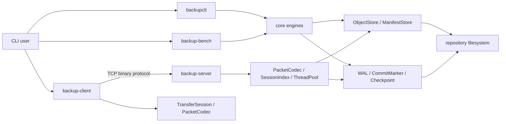
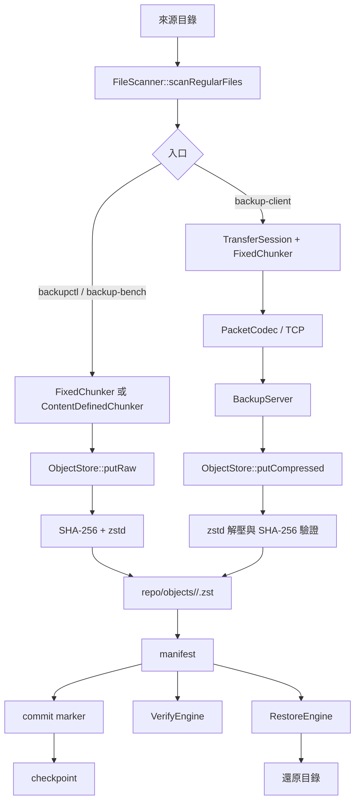
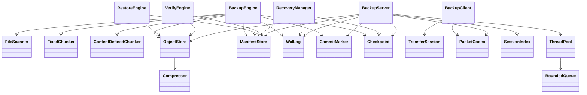
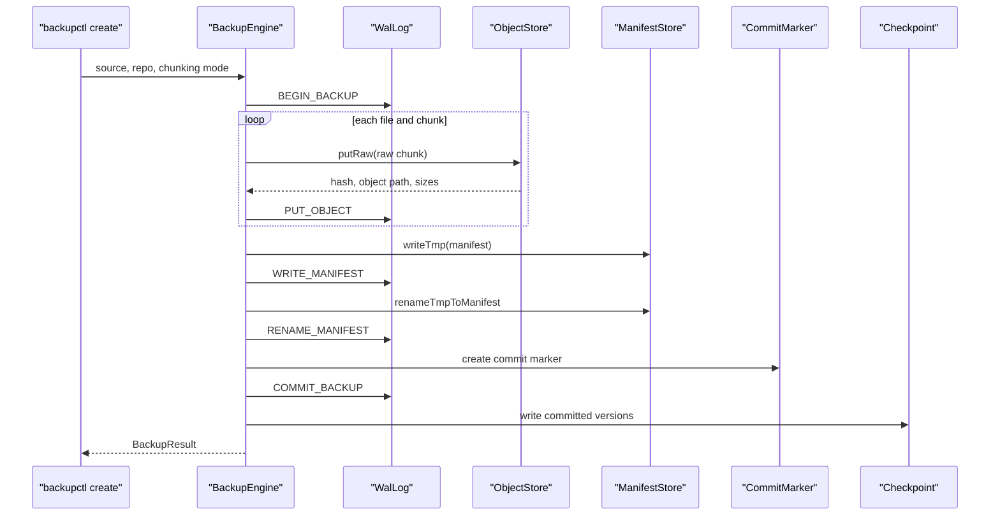

# cpp-data-protection-core

## 專案概述

`cpp-data-protection-core` 是在 Linux 上執行的 C++17 檔案備份核心。專案提供命令列工具（Command-line Tools），可建立本機備份版本、驗證與還原資料、清理暫存檔並重建 checkpoint，以及透過自訂 TCP 協定將來源目錄上傳至備份伺服器。

備份資料以 SHA-256 定址的 zstd 壓縮物件、文字 manifest、commit marker、WAL 與 checkpoint 儲存在一般檔案目錄中。專案不需要資料庫或常駐服務即可執行本機備份流程。

## 功能範圍

建置會產生下列執行檔：

| 執行檔 | 已實作操作 |
| --- | --- |
| `backupctl` | `create`、`list`、`restore`、`verify`、`stats`、`recover`、`checkpoint`、`compact` |
| `backup-client` | 使用固定大小 chunk 上傳來源目錄，並以 session id 補傳中斷的資料 |
| `backup-server` | 接收 TCP 上傳、寫入 repository、建立 manifest 與 commit marker |
| `backup-bench` | 產生本機 workload，執行 backup、verify、restore 與內容比對後輸出 metrics |
| `corrupt-repo` | 測試輔助工具；在 WAL 尾端追加垃圾資料，未包含於安裝與 release 產物 |

目前程式碼包含：

- 固定大小切塊（Fixed-size Chunking）與簡化的內容定義切塊（Content-defined Chunking, CDC）
- raw chunk SHA-256 定址與 repository 內的 chunk 去重
- zstd 壓縮物件
- manifest、commit marker、預寫日誌（Write-ahead Log, WAL）與 checkpoint
- 備份版本驗證、還原與檔案 checksum 檢查
- fault injection 與中斷後的 repository metadata 整理
- 自訂 TCP binary protocol 與 session-based 補傳
- GoogleTest、shell integration test、malformed input test 與 sanitizer 設定
- Docker multi-stage build、Docker Compose Demo 與 GitHub Actions workflows

## 目錄結構

```text
.
├── include/dpc/              # 公開 C++ 標頭
│   ├── common/               # error、hash、檔案與型別工具
│   ├── concurrency/          # BoundedQueue、ThreadPool
│   ├── core/                 # backup、restore、verify、chunk、store
│   ├── metadata/             # WAL、checkpoint、recovery、fault injection
│   └── network/              # client、server、packet、session
├── src/
│   ├── bench/                # backup-bench
│   ├── cli/                  # backupctl、backup-client、backup-server
│   ├── concurrency/
│   ├── core/
│   ├── metadata/
│   ├── network/
│   └── tools/                # corrupt-repo
├── tests/
│   ├── unit/
│   ├── integration/
│   ├── fault_injection/
│   └── security/
├── scripts/                  # build、test、Demo、Docker helper scripts
├── docs/                     # 架構、格式、協定與操作文件
├── .github/workflows/        # CI、sanitizer、Docker、release、CodeQL
├── CMakeLists.txt
├── Dockerfile
└── docker-compose.yml
```

## 系統架構（System Architecture）



`backupctl` 與 `backup-bench` 直接呼叫 `src/core` 和 `src/metadata`。`backup-client` 先由 `TransferSession` 準備固定大小 chunk，再由 `PacketCodec` 傳給 `BackupServer`。伺服器使用 `SessionIndex` 保存上傳進度，最後寫入與本機備份相同的 repository 目錄格式。對應實作位於 `src/cli`、`src/core`、`src/network`、`src/metadata` 與 `src/concurrency`。

## 資料流（Data Flow）



本機流程由 `BackupEngine::create` 呼叫 `ObjectStore::putRaw`，由 object store 計算 raw chunk SHA-256 並壓縮。網路流程在 client 端先壓縮，server 解壓並驗證 hash 後呼叫 `putCompressed`。兩條路徑最後都建立 manifest、commit marker 與 checkpoint。

## 模組關係（Module Relationship）



核心類別的標頭位於 `include/dpc`，實作位於相同模組名稱的 `src` 子目錄。`RecoveryManager` 不重播 WAL 操作；它先驗證 WAL record 格式，再清理 `repo/tmp`，並依 commit marker 重建 checkpoint。

## 備份時序（Sequence Diagram）



此時序對應 `src/core/BackupEngine.cpp`、`src/core/ObjectStore.cpp`、`src/core/ManifestStore.cpp`、`src/metadata/WalLog.cpp`、`src/metadata/CommitMarker.cpp` 與 `src/metadata/Checkpoint.cpp`。fault injection 可在其中五個位置中止流程；commit marker 是版本是否可見的判斷依據。

## 建置流程（Build Process）

### 必要環境

- Linux；目前 Docker 與 GitHub Actions 使用 Ubuntu 24.04，本機亦可在 Ubuntu 22.04 建置
- CMake 3.16 以上
- 支援 C++17 的 GCC 或 Clang
- POSIX threads
- OpenSSL Crypto development package
- zstd shared library 與 development package
- GoogleTest；找不到系統套件時，CMake 會從 GoogleTest `v1.14.0` source archive 取得原始碼，因此該情況需要網路連線
- Ninja 為建議安裝項目；未指定 `CMAKE_GENERATOR` 時可使用系統預設 generator

Ubuntu 套件安裝：

```bash
sudo apt-get update
sudo apt-get install -y build-essential cmake ninja-build libssl-dev libzstd-dev libgtest-dev
```

### 建置指令

```bash
./scripts/build.sh
```

指定 generator、build type 或輸出目錄：

```bash
CMAKE_GENERATOR=Ninja \
CMAKE_BUILD_TYPE=Debug \
DPC_BUILD_DIR=/tmp/dpc-build \
./scripts/build.sh
```

直接使用 CMake：

```bash
cmake -S . -B build -DCMAKE_BUILD_TYPE=RelWithDebInfo
cmake --build build -j"$(nproc)"
```

### 建置產物

預設位置：

```text
build/bin/backupctl
build/bin/backup-client
build/bin/backup-server
build/bin/backup-bench
build/bin/corrupt-repo
build/bin/dpc_unit_tests
build/lib/libdpc_core.a
build/compile_commands.json
```

建置成功時，輸出末段會包含類似下列英文訊息；target 順序與百分比會依 generator 和增量建置狀態不同：

```text
[ 98%] Built target dpc_unit_tests
[100%] Built target gmock_main
```

若使用系統已安裝的 GoogleTest，target 順序與最終百分比可能不同。

## 執行流程（Run Process）

### 本機備份

執行前先完成建置，並準備來源目錄與可寫入的 repository 路徑：

```bash
mkdir -p /tmp/dpc-run/source
printf 'sample data\n' > /tmp/dpc-run/source/file.txt

build/bin/backupctl create \
  --source /tmp/dpc-run/source \
  --repo /tmp/dpc-run/repo \
  --chunking fixed
```

成功輸出範例：

```text
created_version: 1
files: 1
total_input_bytes: 12
stored_bytes: 21
total_chunks: 1
unique_chunks: 1
duplicate_chunks: 0
```

`stored_bytes` 會受 zstd 輸出影響，實際數值可能不同。接著可列出、驗證與還原版本：

```bash
build/bin/backupctl list --repo /tmp/dpc-run/repo
build/bin/backupctl verify --repo /tmp/dpc-run/repo --version 1
build/bin/backupctl restore --repo /tmp/dpc-run/repo --version 1 --target /tmp/dpc-run/restore
diff -r /tmp/dpc-run/source /tmp/dpc-run/restore
```

成功輸出包含：

```text
version: 1 files: 1 input_bytes: 12 stored_bytes: 21 chunking: fixed
verify_ok
restore_ok
```

`diff -r` 成功時不輸出內容，exit code 為 `0`。

### Client/Server 上傳

終端機 1：

```bash
build/bin/backup-server --repo /tmp/dpc-server/repo --port 19090 --threads 4
```

伺服器啟動輸出：

```text
backup-server listening on port 19090
```

終端機 2：

```bash
build/bin/backup-client upload \
  --source /tmp/dpc-run/source \
  --server 127.0.0.1:19090 \
  --session run-001
```

成功輸出：

```text
committed_version 1
```

`backup-server` 目前沒有 graceful shutdown 命令或 signal handler。前景執行時可用 `Ctrl+C` 終止 process；背景執行時以 `kill <pid>` 終止。清理測試資料前應確認 server 已停止：

```bash
rm -rf /tmp/dpc-run /tmp/dpc-server
```

## Demo 步驟（Demo Steps）

下列步驟使用固定位置，便於檢查輸入、repository 與還原結果。

### 前置條件

- 已完成「建置流程」
- `/tmp/dpc-demo` 可寫入
- `diff` 已安裝

### 操作步驟

```bash
rm -rf /tmp/dpc-demo
mkdir -p /tmp/dpc-demo/input/docs
printf 'hello data protection\n' > /tmp/dpc-demo/input/readme.txt
printf 'nested file\n' > /tmp/dpc-demo/input/docs/nested.txt
dd if=/dev/zero of=/tmp/dpc-demo/input/repeated.bin bs=1024 count=192 status=none

build/bin/backupctl create \
  --source /tmp/dpc-demo/input \
  --repo /tmp/dpc-demo/repo \
  --chunking fixed
build/bin/backupctl list --repo /tmp/dpc-demo/repo
build/bin/backupctl verify --repo /tmp/dpc-demo/repo --version 1
build/bin/backupctl restore \
  --repo /tmp/dpc-demo/repo \
  --version 1 \
  --target /tmp/dpc-demo/output
diff -r /tmp/dpc-demo/input /tmp/dpc-demo/output
```

輸入資料位於 `/tmp/dpc-demo/input`，repository 位於 `/tmp/dpc-demo/repo`，還原結果位於 `/tmp/dpc-demo/output`。預期終端機輸出包含：

```text
created_version: 1
files: 3
total_input_bytes: 196642
stored_bytes: <value>
total_chunks: 5
unique_chunks: 3
duplicate_chunks: 2
version: 1 files: 3 input_bytes: 196642 stored_bytes: <value> chunking: fixed
verify_ok
restore_ok
```

`<value>` 是壓縮後新增 object bytes，依 zstd 版本可能不同。專案另提供可重現的 helper scripts；這些 scripts 使用 `mktemp`，結束時會刪除輸入、repository 與輸出：

```bash
./scripts/demo_local_backup.sh
./scripts/demo_crash_recovery.sh
./scripts/demo_client_server.sh
```

成功時最後一行分別為：

```text
local backup demo ok
crash recovery demo ok
client/server demo ok
```

## 預期結果（Expected Result）

Demo 成功後應符合下列條件：

- `/tmp/dpc-demo/repo/objects` 內存在 `.zst` object。
- `/tmp/dpc-demo/repo/manifests/version-000001.manifest` 與 `version-000001.commit` 同時存在。
- `/tmp/dpc-demo/repo/metadata/wal.log` 與 `checkpoint.dat` 存在。
- `backupctl verify` 輸出 `verify_ok`。
- `backupctl restore` 輸出 `restore_ok`。
- `/tmp/dpc-demo/input` 與 `/tmp/dpc-demo/output` 的 `diff -r` exit code 為 `0`。

若結果不同，依序檢查：

1. `build/bin` 下的執行檔是否存在。
2. `--source`、`--repo`、`--version` 與 `--target` 是否使用相同 Demo 路徑。
3. `backupctl list --repo /tmp/dpc-demo/repo` 是否列出 version 1。
4. manifest 與 commit marker 是否同時存在。
5. `verify` 的英文錯誤訊息是否指出 missing object、checksum mismatch、manifest 或 WAL 格式錯誤。

## 設定檔說明

專案沒有獨立的 runtime 設定檔。執行參數來自 CLI，建置與 helper scripts 使用下列設定：

| 設定 | 位置 | 用途 |
| --- | --- | --- |
| `DPC_BUILD_TESTS` | CMake option | 是否建置 `dpc_unit_tests`，預設 `ON` |
| `DPC_ENABLE_ASAN` | CMake option | 啟用 AddressSanitizer，預設 `OFF` |
| `DPC_ENABLE_UBSAN` | CMake option | 啟用 UndefinedBehaviorSanitizer，預設 `OFF` |
| `DPC_ENABLE_TSAN` | CMake option | 啟用 ThreadSanitizer，不能與 ASan/UBSan 同時使用 |
| `DPC_BUILD_DIR` | scripts environment | 指定建置目錄，預設 `build` |
| `CMAKE_BUILD_TYPE` | scripts environment | 指定 CMake build type，預設 `RelWithDebInfo` |
| `CMAKE_GENERATOR` | scripts environment | 選擇 CMake generator |
| `CMAKE_ARGS` | scripts environment | 傳入額外 CMake arguments；以空白切分 |
| `DPC_BENCH_SIZE` | `scripts/bench.sh` | benchmark 大檔大小，預設 `64M` |
| `DPC_BENCH_CHUNKING` | `scripts/bench.sh` | benchmark chunking，預設 `fixed` |
| `DPC_DEMO_PORT` | client/server 與 Docker Demo | host/demo port，預設 `19090` |
| `docker-compose.yml` | Docker Compose | 定義單一 `demo-runner` service 與 `server-repo` volume |

`repo/metadata/*.dat`、`wal.log` 與 `sessions/*.session` 是程式產生的 repository metadata，不是供使用者手動編輯的設定檔。

## 常見操作與除錯

查看 CLI 參數：

```bash
build/bin/backupctl --help
build/bin/backup-client --help
build/bin/backup-server --help
```

執行所有預設測試：

```bash
./scripts/test.sh
```

清除預設建置目錄後重建：

```bash
./scripts/clean.sh
./scripts/build.sh
```

整理中斷後留下的 `repo/tmp` 並重建 checkpoint：

```bash
build/bin/backupctl recover --repo <repo-path>
```

`recover` 會先完整讀取並驗證 WAL。WAL 已截斷或 CRC 錯誤時，命令會失敗，不會略過損壞 record。

連線 Demo 的 19090 port 被占用時：

```bash
DPC_DEMO_PORT=19190 ./scripts/demo_client_server.sh
```

檢查 repository 統計：

```bash
build/bin/backupctl stats --repo <repo-path>
```

## 限制與目前未涵蓋範圍

- 沒有 authentication、authorization、TLS、object encryption 或 key management。
- 沒有 Web UI、REST API、gRPC API、cloud backend 或外部 metadata database。
- repository format 目前沒有 migration tool 或跨版本 compatibility policy。
- manifest 只保存 regular file 內容與 mode；不保存 empty directory、symlink type、hard-link 關係、ACL、xattr 或 ownership。
- chunking 與 restore 會把單一檔案或還原內容載入記憶體，不適合直接推論大型資料集的 peak memory。
- 沒有 repository writer lock；同一 repository 不應同時執行多個 create 或 commit 操作。
- CDC 是簡化 rolling hash，不是 Rabin fingerprint。
- client/server 上傳只使用固定大小 chunk；協定沒有加密與身分驗證。
- `backup-server` 使用 blocking socket、固定 worker pool 與 capacity 128 的 bounded queue；一個連線會占用一個 worker。
- `backup-server` 沒有 graceful shutdown 命令或 signal handler。
- session index 使用 append-only 文字檔，commit 後不會自動刪除。
- `backup-bench` 的 throughput 是單次本機量測，且程式以 MiB 計算但欄位名稱保留 `MB/s`；結果受 CPU、storage、compiler、build type 與 page cache 影響。
- Docker runtime image 以 root 執行，未提供 SBOM、image signing、provenance 或 multi-architecture build。

## 文件索引

- [架構](docs/architecture.md)
- [圖示](docs/diagrams.md)
- [備份格式](docs/backup-format.md)
- [切塊與去重](docs/chunking-and-dedup.md)
- [中斷恢復](docs/crash-recovery.md)
- [傳輸協定](docs/transfer-protocol.md)
- [並行模型](docs/concurrency-model.md)
- [Benchmark](docs/benchmark.md)
- [內部 API 與 STL 選擇](docs/api-and-stl-rationale.md)
- [實作決策](docs/implementation-decisions.md)
- [技術備註](docs/technical-notes.md)
- [Docker](docs/docker.md)
- [Docker 設定狀態](docs/docker-status.md)
- [GitHub Actions](docs/cicd.md)
- [CI/CD 設定狀態](docs/cicd-status.md)
- [Release](docs/release.md)
