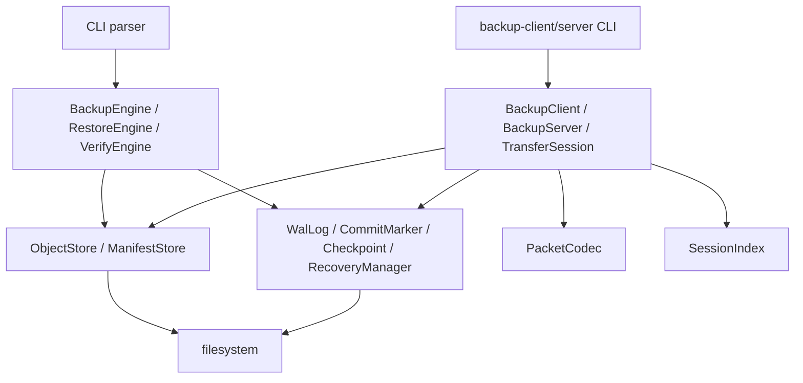
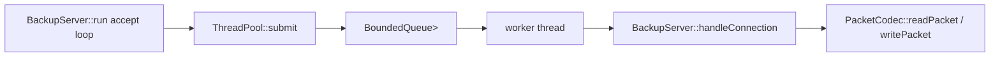
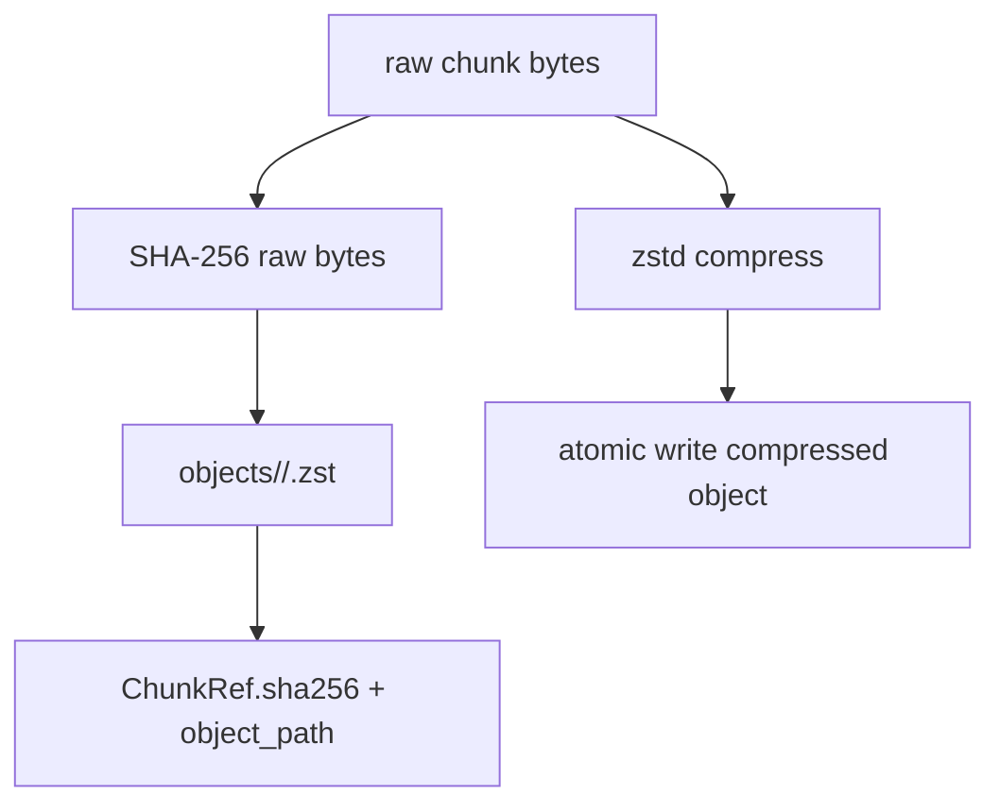

# 內部 API 與 STL 選擇

本文件說明目前程式內部 API 的呼叫關係，以及主要 STL 容器與 C++ 標準函式庫 API 的使用位置。這裡的 API 指 repository 內 C++ 類別與函式，不是 HTTP、REST 或 gRPC API。

## 內部 API

| Entry | Internal API | 主要責任 | 對應檔案 |
| --- | --- | --- | --- |
| `backupctl create` | `BackupEngine::create` | 掃描來源、切 chunk、寫 object、manifest、WAL、commit marker | `src/core/BackupEngine.cpp` |
| `backupctl restore` | `RestoreEngine::restore` | 讀 manifest、讀 object、驗證 chunk/file checksum、寫回 target | `src/core/RestoreEngine.cpp` |
| `backupctl verify` | `VerifyEngine::verify` | 讀 manifest、重新讀 object 並驗證 checksum | `src/core/VerifyEngine.cpp` |
| `backupctl recover` | `RecoveryManager::recover` | 驗證 WAL、刪除 `repo/tmp` regular files、依 commit marker 重建 checkpoint | `src/metadata/RecoveryManager.cpp` |
| `backup-client upload` | `BackupClient::upload` | 建立 chunk payload、查詢 session、補傳缺少 chunk、送 commit | `src/network/BackupClient.cpp` |
| `backup-server` | `BackupServer::run` | TCP listen、thread pool dispatch、處理 packet、寫入 repo | `src/network/BackupServer.cpp` |
| `backup-bench` | benchmark main | 產生 workload、跑 backup/verify/restore、比對 correctness、輸出 metrics | `src/bench/backup_bench_main.cpp` |

## API 呼叫關係

此圖對應 `include/dpc/core/*`、`include/dpc/metadata/*`、`include/dpc/network/*`。CLI 只負責參數解析與錯誤邊界，核心行為放在可測試的類別中。

## PacketCodec wire encoding

`PacketCodec` 使用 `encode` / `decode` 明確處理 big-endian 欄位，而不是把 C++ struct 直接寫入 socket。

| 選項 | 目前採用 | 原因 |
| --- | --- | --- |
| explicit encode/decode | 是 | 避免 struct padding、endianness、ABI 差異；方便檢查 magic/version/type/size/CRC |
| raw struct write/read | 否 | 會讓 wire format 依 compiler 與平台 layout 變動 |
| HTTP/gRPC | 否 | 目前專案只需要本地 demo 的 binary TCP protocol；HTTP/gRPC 列為非目標 |

對應檔案：`include/dpc/network/PacketCodec.hpp`、`src/network/PacketCodec.cpp`。

## STL 容器

| 使用位置 | 容器/API | 選用理由 | 可替代方案與取捨 |
| --- | --- | --- | --- |
| `ByteVector` | `std::vector<std::uint8_t>` | 連續記憶體，適合 SHA-256、zstd、packet payload、檔案讀寫 | `std::string` 不適合表示任意 binary；C++17 沒有標準 `std::span`，目前 API 直接傳遞 owning vector |
| `Manifest.files` | `std::vector<FileManifest>` | manifest 以順序讀寫，restore/verify 主要是線性掃描 | `std::map` 可查找但會改變資料模型；目前不需要隨機查找 |
| `FileManifest.chunks` | `std::vector<ChunkRef>` | chunk 依檔案內順序處理，寫入與讀取都是線性 | linked list 會增加配置成本，且不利 cache locality |
| `SessionIndex::received` | `std::map<std::uint64_t, std::string>` | 依 global chunk index 排序輸出 session status，方便 deterministic response | `std::unordered_map` 查找較快，但輸出順序不穩定 |
| `SessionIndex::buildManifest` | `std::map<std::uint64_t, ReceivedChunkRecord>` | 檢查 `0..total_chunks-1` 是否完整，並依 global index 建 manifest | `std::vector<std::optional<...>>` 可更直接，但會引入較多初始化與 memory tradeoff |
| file grouping | `std::map<std::string, FileManifest>` | 依 relative path 聚合 chunk，輸出 manifest 順序 deterministic | `unordered_map` 需要額外排序才能得到穩定輸出 |
| `BoundedQueue` | `std::deque<T>` | `push_back` / `pop_front` 不需要搬移整個 queue | `std::queue` 也可用，但 `deque` 直接暴露需要的操作且簡單 |
| `ThreadPool` workers | `std::vector<std::thread>` | worker 數量固定，vector 管理 thread 列表簡單 | `std::list` 沒有優勢 |
| stop flag | `std::atomic<bool>` | 跨 worker thread 讀寫停止狀態，不需要為單一 flag 加 mutex | 若狀態更多，應改回 mutex 保護共享狀態 |
| packet SHA | `std::array<std::uint8_t, 32>` | SHA-256 header 欄位固定 32 bytes，不需要 heap allocation | `std::vector` 可變長，反而需要額外長度檢查 |
| filesystem paths | `std::filesystem::path` | C++17 標準路徑 API，支援組合、正規化與平台路徑語意 | 字串拼接容易漏掉 separator 與 traversal 檢查 |

## Threading API

Server 使用 blocking socket 加 bounded thread pool。每個活躍 connection 由一個 worker 執行，queue capacity 固定為 128；大量 idle connections 也會占用 worker。程式沒有 epoll/reactor、connection timeout 或 graceful shutdown command。

## Storage API

object identity 使用 raw chunk SHA-256，而不是 compressed bytes hash。這樣 verify/restore 可以在解壓後重新計算 raw chunk hash，確認 object 內容沒有被修改成另一段壓縮資料。

## 目前介面範圍

- 對外介面只有 CLI 與自訂 TCP binary protocol，沒有 REST/gRPC API。
- Metadata 使用一般檔案，沒有 SQLite 或其他 database backend。
- Ordered containers 用於 deterministic serialization 與依 index 組裝資料；程式沒有另外維護全域索引服務。
- TCP server 是 blocking I/O，沒有 event loop。
