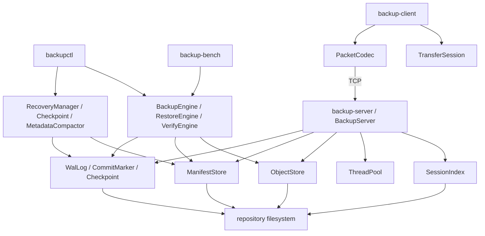

# 系統架構

程式碼分成 `common`、`core`、`metadata`、`network` 與 `concurrency`。對外入口是四個主要執行檔：`backupctl`、`backup-client`、`backup-server` 與 `backup-bench`；`corrupt-repo` 只供 WAL 損壞測試使用。

## 模組責任

| 模組 | 主要檔案 | 責任 |
| --- | --- | --- |
| common | `include/dpc/common/*` | error 型別、SHA-256、檔案 I/O、atomic write、fsync、路徑驗證 |
| core | `include/dpc/core/*`、`src/core/*` | 掃描 regular files、chunking、zstd、object store、manifest、backup、restore、verify |
| metadata | `include/dpc/metadata/*`、`src/metadata/*` | WAL、commit marker、checkpoint、metadata compaction、recovery、fault injection |
| network | `include/dpc/network/*`、`src/network/*` | TCP client/server、packet codec、上傳資料準備、session index |
| concurrency | `include/dpc/concurrency/*`、`src/concurrency/*` | bounded queue 與固定大小 thread pool |

## 入口與儲存層

此圖對應 `src/cli`、`src/bench`、`src/core`、`src/network`、`src/metadata` 與 `src/concurrency`。程式沒有資料庫、外部 message queue、cache service、HTTP API 或 gRPC API。

## 本機 create 流程

1. `src/cli/backupctl_main.cpp` 解析 `create` 參數。
2. `BackupEngine::create` 透過 `ObjectStore::ensureLayout` 建立 repository 目錄。
3. `WalLog` 寫入 `BEGIN_BACKUP`。
4. `FileScanner` 掃描來源目錄中的 regular files。
5. `FixedChunker` 或 `ContentDefinedChunker` 產生 chunks。
6. `ObjectStore::putRaw` 計算 raw chunk SHA-256、呼叫 `Compressor` 產生 zstd frame，並寫入 hash-derived object path。
7. `BackupEngine` 累積 file SHA-256 與 manifest 欄位，並為每個 chunk 寫入 `PUT_OBJECT` WAL record。
8. `ManifestStore` atomic-write 暫存 manifest，再 rename 到正式路徑。
9. `CommitMarker` 建立 `.commit`；之後 `WalLog` 寫入 `COMMIT_BACKUP`。
10. `Checkpoint` 依目前 commit markers 寫入 committed version 清單。

## Verify 與 restore

`VerifyEngine` 與 `RestoreEngine` 都透過 `ManifestStore::load` 讀取有 commit marker 的版本，再由 `ObjectStore::readRaw` 重算 expected object path、解壓並驗證 chunk SHA-256。兩者都驗證完整 file size 與 file SHA-256；`RestoreEngine` 另外將資料寫入 target directory 並套用 manifest 中的 mode。

Manifest parser 和 restore 都使用 `fileutil::safeRelativePath` 檢查 relative path。這是詞法路徑檢查，不包含 ACL、ownership、xattr 或 symlink metadata 還原。

## Network upload

`TransferSession::prepareChunks` 使用 `FixedChunker` 讀取來源檔案，並在 client 端產生 raw SHA-256 與 zstd payload。Server 收到 `PUT_CHUNK` 後先解壓並驗證 header SHA-256，再寫入 object store 與 session index。

同一個 session id 重新上傳時，server 回覆已保存的 global chunk index 與 hash；client 只傳送缺少或 hash 不同的 chunk。`COMMIT_SESSION` 會建立 manifest、commit marker、WAL records 與 checkpoint，最後在 session index 追加 `COMMITTED <version>`。

## Recovery

`RecoveryManager::recover` 不重播 WAL payload。它依序：

1. 建立缺少的 repository 目錄。
2. 呼叫 `WalLog::readAll` 驗證整份 WAL。
3. 刪除 `repo/tmp` 下的 regular files。
4. 由 commit marker 列出 committed versions。
5. 重寫 checkpoint。

## 相關文件

- [圖示](diagrams.md)
- [備份格式](backup-format.md)
- [中斷恢復](crash-recovery.md)
- [傳輸協定](transfer-protocol.md)
- [並行模型](concurrency-model.md)
