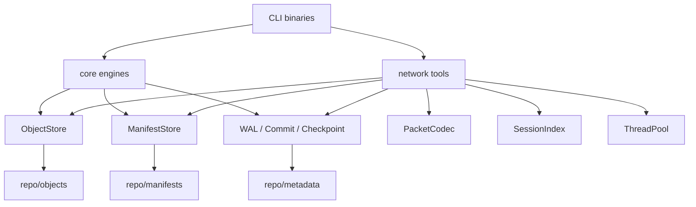

# Architecture

本文說明目前程式碼中的模組責任與執行流程。實作集中在 `include/dpc` 與 `src`，外部介面是四個主要 CLI binary：`backupctl`、`backup-client`、`backup-server`、`backup-bench`。

## 模組責任

| 模組 | 主要檔案 | 責任 |
| --- | --- | --- |
| common | `include/dpc/common/*` | 錯誤型別、SHA-256、檔案讀寫、atomic write、fsync、路徑檢查 |
| core | `include/dpc/core/*`, `src/core/*` | 檔案掃描、chunking、zstd、object store、manifest、backup/restore/verify |
| metadata | `include/dpc/metadata/*`, `src/metadata/*` | WAL、commit marker、checkpoint、recovery、compaction、fault injection |
| network | `include/dpc/network/*`, `src/network/*` | TCP client/server、packet codec、session index、上傳流程 |
| concurrency | `include/dpc/concurrency/*`, `src/concurrency/*` | bounded queue 與 thread pool |

## 系統架構圖

此圖對應 `src/cli/*`、`src/core/*`、`src/network/*` 與 `src/metadata/*`。目前沒有資料庫、佇列服務、cache service 或外部 API。

## Create 流程

1. `backupctl_main.cpp` 解析 `create` 參數。
2. `BackupEngine::create` 建立 repository layout。
3. `WalLog` 寫入 `BEGIN_BACKUP`。
4. `FileScanner` 掃描 regular files。
5. `FixedChunker` 或 `ContentDefinedChunker` 切 chunk。
6. `Hash` 計算 raw chunk SHA-256。
7. `Compressor` 將 chunk 壓縮成 zstd frame。
8. `ObjectStore` 以 atomic write 寫入 `objects/<prefix>/<sha>.zst`。
9. `ManifestStore` 寫入 tmp manifest，再 rename 成正式 manifest。
10. `CommitMarker` 建立 `version-000001.commit`。
11. `WalLog` 寫入 `COMMIT_BACKUP`，`Checkpoint` 更新 committed version。

## Restore / Verify 流程

`RestoreEngine` 與 `VerifyEngine` 都會讀取 committed manifest。差別是 `RestoreEngine` 會把檔案寫回 target directory，`VerifyEngine` 只檢查 object、chunk checksum 與 file checksum。

`RestoreEngine` 使用 `fileutil::safeRelativePath` 檢查 manifest 中的 relative path，避免還原時寫出 target directory。

## Network 流程

`backup-client` 使用 `TransferSession::prepareChunks` 將來源資料轉成 chunk record，再透過 `PacketCodec` 傳送封包。`backup-server` 收到 chunk 後寫入 `ObjectStore`，並把已收到的 chunk 記錄在 `metadata/sessions/<hex-session-id>.session`。同一個 session id 再次上傳時，server 會回覆已收到 chunk，client 只送缺少的項目。

## 相關文件

- [backup-format.md](backup-format.md)
- [transfer-protocol.md](transfer-protocol.md)
- [concurrency-model.md](concurrency-model.md)
- [diagrams.md](diagrams.md)
