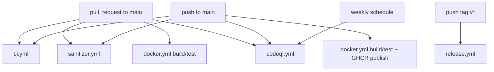

# GitHub Actions CI/CD

本 repository 提供五個 GitHub Actions workflow。它們用於建置、測試、sanitizer、Docker image、GHCR、release artifact 與 CodeQL 分析。這些 workflow 是自動驗證流程，不代表 runtime image 已做安全加固。

以下設定以 GitHub repository `JiaChangGit/cpp-data-protection-core` 為準。

## Repository Setup

第一次推上 GitHub 時可使用：

```bash
git remote add origin git@github.com:JiaChangGit/cpp-data-protection-core.git
git branch -M main
git push -u origin main
```

GitHub repository settings：

1. `Settings -> Actions -> General`
2. `Actions permissions` 選擇允許 repository workflows。
3. `Workflow permissions` 選擇 `Read and write permissions`。
4. 保留 `Allow GitHub Actions to create and approve pull requests` 關閉，除非後續真的需要 bot PR。

本專案目前不需要自訂 secret。Docker publish 使用 GitHub 內建的 `GITHUB_TOKEN`。

## Workflow Map



PR 不推送 GHCR image。`main` push 或 manual dispatch 才會推送 runtime image。

## ci.yml

觸發條件：

- push to `main`
- pull request to `main`
- manual `workflow_dispatch`

Jobs：

| Job | 內容 |
| --- | --- |
| `build-and-test-gcc` | 安裝依賴、GCC build、執行 unit tests |
| `build-and-test-clang` | 安裝依賴、Clang build、執行 unit tests |
| `integration-test` | 執行 `tests/integration/backup_restore_verify_test.sh` |
| `fault-injection-test` | 執行 `tests/fault_injection/crash_recovery_test.sh` |
| `security-malformed-test` | 執行 `tests/security/security_malformed_test.sh` |
| `benchmark-smoke` | 以 `DPC_BENCH_SIZE=8M` 執行 `scripts/bench.sh`，確認 benchmark correctness gate |
| `static-analysis` | 執行 cppcheck 與 scoped clang-tidy checks |

`static-analysis` 的 clang-tidy 目前只掃描部分檔案：

```text
src/core/FixedChunker.cpp
src/core/Compressor.cpp
src/network/PacketCodec.cpp
```

## sanitizer.yml

觸發條件：

- push to `main`
- pull request to `main`
- manual `workflow_dispatch`

Jobs：

- `asan-ubsan`：以 `DPC_ENABLE_ASAN=ON` 與 `DPC_ENABLE_UBSAN=ON` 執行 `./scripts/test.sh`
- `tsan`：以 `DPC_ENABLE_TSAN=ON` 建置，接著執行 `ctest --test-dir build-tsan --output-on-failure`

TSan 不能和 ASan/UBSan 同時啟用，這個限制在 `CMakeLists.txt` 中檢查。本機 WSL 可能無法穩定執行 TSan runtime；CI 使用 GitHub hosted `ubuntu-24.04` runner。

## docker.yml

觸發條件：

- push to `main`
- pull request to `main`
- manual `workflow_dispatch`

流程：

1. Build Docker `test` image。
2. Run Docker test image。
3. Build Docker `runtime` image。
4. Run Docker Compose client/server demo。
5. 非 pull request 且為 `main` push 或 manual dispatch 時登入 GHCR。
6. Build and publish runtime image。

GHCR tags for `JiaChangGit/cpp-data-protection-core`：

```text
ghcr.io/jiachanggit/cpp-data-protection-core:latest
ghcr.io/jiachanggit/cpp-data-protection-core:<git-sha>
```

Docker image reference 必須使用小寫路徑。`docker.yml` 會把 `GITHUB_REPOSITORY_OWNER` 轉成 lowercase 後組出 image name，因此 `JiaChangGit` 會變成 `jiachanggit`。

需要 repository workflow permission 允許 write：

```yaml
permissions:
  contents: read
  packages: write
```

## release.yml

觸發條件：

- push tag `v*`

流程：

1. checkout
2. install dependencies
3. `./scripts/test.sh`
4. copy binaries、README、docs
5. create tar.gz
6. create sha256 file
7. create GitHub Release

輸出 artifact：

```text
cpp-data-protection-core-linux-x86_64.tar.gz
cpp-data-protection-core-linux-x86_64.sha256
```

## codeql.yml

觸發條件：

- push to `main`
- pull request to `main`
- weekly schedule
- manual `workflow_dispatch`

CodeQL 使用 `c-cpp` manual build mode，執行 `./scripts/build.sh` 後上傳分析結果。它不是 unit test、integration test 或 sanitizer 的替代品。

## Pull Request 與 Main Push

Pull request 會跑 build/test、sanitizer、Docker build/test/demo 與 CodeQL，不會推送 GHCR image。

Push to `main` 會跑相同驗證，且 Docker workflow 可推送 GHCR image。

Push `v*` tag 會觸發 release workflow。

## Release Flow

發版前先在本機執行：

```bash
./scripts/clean.sh
./scripts/build.sh
./scripts/test.sh
./scripts/demo_local_backup.sh
./scripts/demo_crash_recovery.sh
./scripts/demo_client_server.sh
./scripts/bench.sh
./scripts/docker_test.sh
./scripts/docker_demo.sh
```

建立 tag：

```bash
git tag v0.1.0
git push origin v0.1.0
```

GitHub Actions 會建立 release artifact 與 `.sha256` checksum。

## 本機對應指令

```bash
./scripts/build.sh
./scripts/test.sh
./scripts/docker_test.sh
./scripts/docker_demo.sh
```

ASan/UBSan：

```bash
DPC_BUILD_DIR=/tmp/dpc-asan CMAKE_BUILD_TYPE=Debug CMAKE_ARGS="-DDPC_ENABLE_ASAN=ON -DDPC_ENABLE_UBSAN=ON" ./scripts/test.sh
```

TSan build：

```bash
DPC_BUILD_DIR=/tmp/dpc-tsan CMAKE_BUILD_TYPE=Debug CMAKE_ARGS="-DDPC_ENABLE_TSAN=ON" ./scripts/build.sh
```
