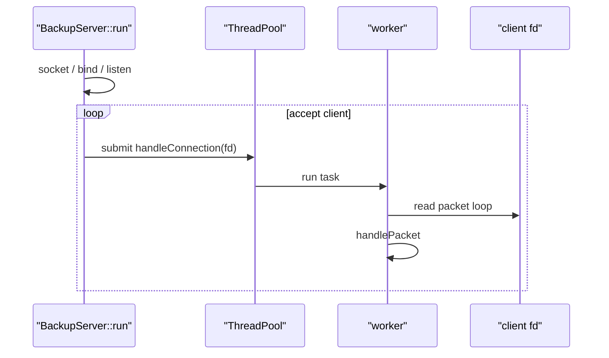

# 並行模型

並行處理集中在 `ThreadPool`、`BoundedQueue` 與 `BackupServer`。本機 backup、restore 與 verify 是同步流程；TCP server 使用 worker pool 處理連線。

## ThreadPool

`ThreadPool` 使用固定數量 worker thread 與 bounded queue。建構參數在 `BackupServer` 中：

```cpp
BackupServer::BackupServer(std::filesystem::path repo, int port, std::size_t workers)
    : repo_(std::move(repo)), port_(port), pool_(workers == 0 ? 1 : workers, 128) {}
```

因此 `--threads 0` 會被轉成 1。CLI 預設 worker 數為 4，queue capacity 固定為 128。

## BoundedQueue

`BoundedQueue` 使用 mutex 與 condition variable。queue 滿時 producer 會等待；shutdown 後會喚醒等待中的 producer/consumer。

此行為由 `tests/unit/test_bounded_queue.cpp` 覆蓋。

## BackupServer 流程



`BackupServer::handleConnection` 使用 blocking `PacketCodec::readPacket`。每個 connection 由一個 worker 處理，connection 內的 packet 依序處理。

## Process 終止

`BackupServer::stop` 會設定 `stopped_` 並呼叫 `pool_.shutdown()`，但 `backup_server_main.cpp` 沒有註冊 signal handler，也沒有其他程式路徑呼叫 `stop`。Demo scripts 以 `kill` 終止整個背景 process；前景執行可用 `Ctrl+C` 觸發作業系統的預設 process termination。

## 目前限制

- 沒有 epoll 或 non-blocking event loop。
- 一個活躍 connection 會佔用一個 worker。
- Queue 滿時 `accept` loop 會在 `ThreadPool::submit` 內等待可用容量。
- 沒有 graceful shutdown command、per-client authentication、connection timeout 或 rate limit。
