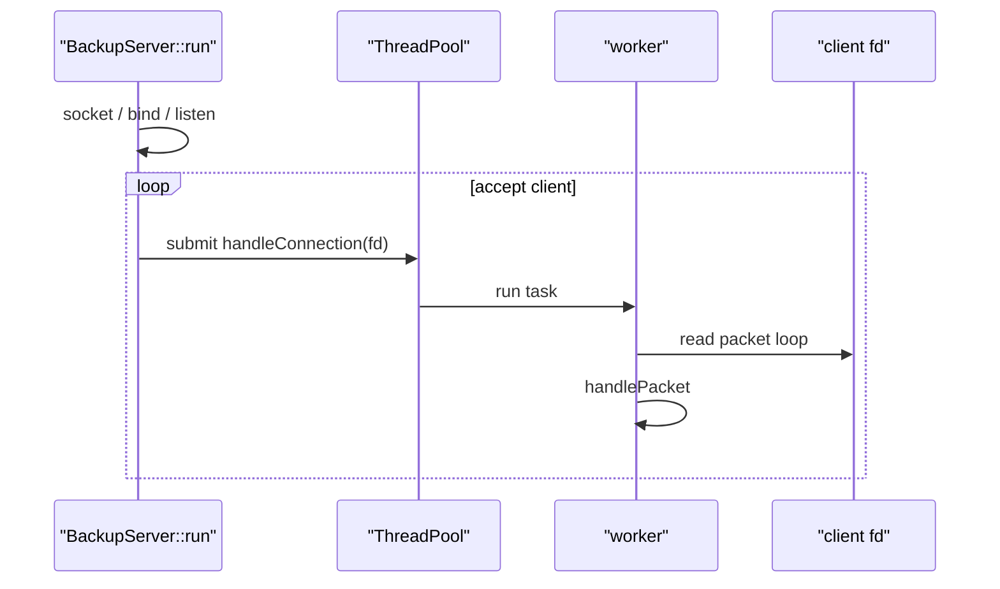

# Concurrency Model

目前 concurrency 實作集中在 `ThreadPool`、`BoundedQueue` 與 `BackupServer`。本機 backup/restore/verify 流程主要是單 process 內的同步流程；TCP server 會使用 worker pool 處理連線。

## ThreadPool

`ThreadPool` 使用固定數量 worker thread 與 bounded queue。建構參數在 `BackupServer` 中：

```cpp
BackupServer::BackupServer(std::filesystem::path repo, int port, std::size_t workers)
    : repo_(std::move(repo)), port_(port), pool_(workers == 0 ? 1 : workers, 128) {}
```

因此 `--threads 0` 會被轉成 1。queue capacity 目前固定為 128。

## BoundedQueue

`BoundedQueue` 使用 mutex 與 condition variable。queue 滿時 producer 會等待；shutdown 後會喚醒等待中的 producer/consumer。

此行為由 `tests/unit/test_bounded_queue.cpp` 覆蓋。

## BackupServer Flow



`BackupServer::handleConnection` 使用 blocking `PacketCodec::readPacket`。每個 connection 由一個 worker 處理，connection 內的 packet 依序處理。

## Shutdown

`BackupServer::stop` 會設定 `stopped_` 並呼叫 `pool_.shutdown()`。目前 server CLI 透過 signal handler 呼叫 `stop`。demo script 會用 `kill` 停止背景 server process。

## 目前限制

- 沒有 epoll 或 non-blocking event loop。
- 一個活躍 connection 會佔用一個 worker。
- 沒有 per-client authentication 或 rate limit。
- Server process 的長時間壓力測試尚未納入 CI。
