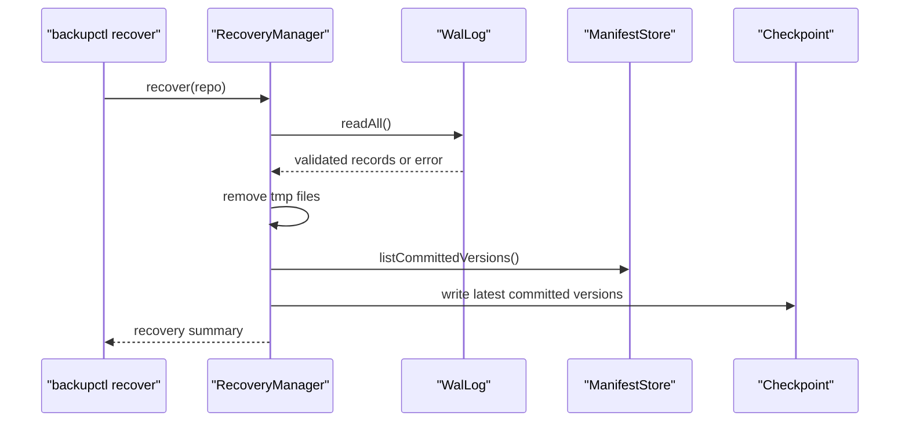

# 中斷恢復

中斷恢復（Crash Recovery）由 `WalLog`、`CommitMarker`、`Checkpoint`、`RecoveryManager` 與 `FaultInjector` 組成。測試腳本在 `tests/fault_injection/crash_recovery_test.sh`，Demo 腳本在 `scripts/demo_crash_recovery.sh`。

## 版本可見性

Committed version 的判斷依據是 manifest 與 commit marker：

```text
manifests/version-000001.manifest
manifests/version-000001.commit
```

`ManifestStore::listCommittedVersions` 依 `.commit` 檔名列出 version。Manifest rename 之後、commit marker 之前發生中斷時，該 version 不會列出；commit marker 已建立後，即使尚未寫入 `COMMIT_BACKUP` WAL record，version 仍然可見。

## WAL records

`BackupEngine::create` 會依序寫入：

1. `BEGIN_BACKUP`
2. `PUT_OBJECT`
3. `WRITE_MANIFEST`
4. `RENAME_MANIFEST`
5. `COMMIT_BACKUP`

正常的 `BackupEngine::create` 會在 commit marker 建立後寫入 `COMMIT_BACKUP`。`MetadataCompactor` 會以 `CHECKPOINT` 和 `COMPACT` 兩筆 record 取代既有 WAL。`WalLog::readAll` 只做結構驗證，不重播 record payload。

## Fault Stages

`backupctl create` 支援：

```bash
build/bin/backupctl create --source <path> --repo <path> --fault-stage after-begin
build/bin/backupctl create --source <path> --repo <path> --fault-stage after-object-write
build/bin/backupctl create --source <path> --repo <path> --fault-stage after-manifest-write
build/bin/backupctl create --source <path> --repo <path> --fault-stage after-manifest-rename
build/bin/backupctl create --source <path> --repo <path> --fault-stage after-commit-marker
```

`after-begin`、`after-object-write`、`after-manifest-write` 與 `after-manifest-rename` 不會建立 committed version。`after-commit-marker` 在 marker 建立後立即中止，因此 version 已可見；`recover` 會重建 checkpoint，但不是讓該 version 變成 committed 的動作。

## Recovery 流程



此圖對應 `src/metadata/RecoveryManager.cpp`、`src/metadata/WalLog.cpp`、`src/core/ManifestStore.cpp` 與 `src/metadata/Checkpoint.cpp`。WAL 驗證失敗時，`recover` 會在清理 `tmp/` 之前回傳錯誤。

## 驗證

```bash
./tests/fault_injection/crash_recovery_test.sh
./scripts/demo_crash_recovery.sh
```

成功輸出範例：

```text
crash recovery demo ok
```
