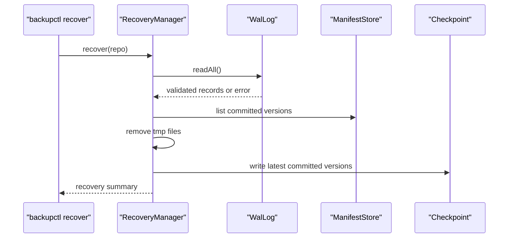

# Crash Recovery

Crash recovery 由 `WalLog`、`CommitMarker`、`Checkpoint`、`RecoveryManager` 與 `FaultInjector` 組成。測試腳本在 `tests/fault_injection/crash_recovery_test.sh`，demo 腳本在 `scripts/demo_crash_recovery.sh`。

## Commit Visibility

Committed version 的判斷依據是 manifest 與 commit marker：

```text
manifests/version-000001.manifest
manifests/version-000001.commit
```

`backupctl list` 只列出有 commit marker 的 version。這個規則讓 manifest rename 之後、commit marker 之前發生中斷時，不會把該 version 當作可用備份。

## WAL Record

`BackupEngine::create` 會依序寫入：

1. `BEGIN_BACKUP`
2. `PUT_OBJECT`
3. `WRITE_MANIFEST`
4. `RENAME_MANIFEST`
5. `COMMIT_BACKUP`

`Checkpoint` 與 `MetadataCompactor` 也會寫入相關 record。`WalLog::readAll` 會檢查 magic、version、payload size 與 CRC。

## Fault Stages

`backupctl create` 支援：

```bash
build/bin/backupctl create --source <path> --repo <path> --fault-stage after-begin
build/bin/backupctl create --source <path> --repo <path> --fault-stage after-object-write
build/bin/backupctl create --source <path> --repo <path> --fault-stage after-manifest-write
build/bin/backupctl create --source <path> --repo <path> --fault-stage after-manifest-rename
build/bin/backupctl create --source <path> --repo <path> --fault-stage after-commit-marker
```

`after-commit-marker` 之前的中斷不應產生 committed version。`after-commit-marker` 的中斷可由 `backupctl recover` 重新整理 checkpoint 後看到 version。

## Recovery Flow



此圖對應 `src/metadata/RecoveryManager.cpp`、`src/metadata/WalLog.cpp`、`src/core/ManifestStore.cpp` 與 `src/metadata/Checkpoint.cpp`。

## Validation

```bash
./tests/fault_injection/crash_recovery_test.sh
./scripts/demo_crash_recovery.sh
```

成功輸出範例：

```text
crash recovery demo ok
```
