# Diagrams

本文件集中放置目前架構與主要流程圖。圖中的節點都對應目前 repository 中存在的程式碼、腳本或檔案格式。

## System Architecture Diagram

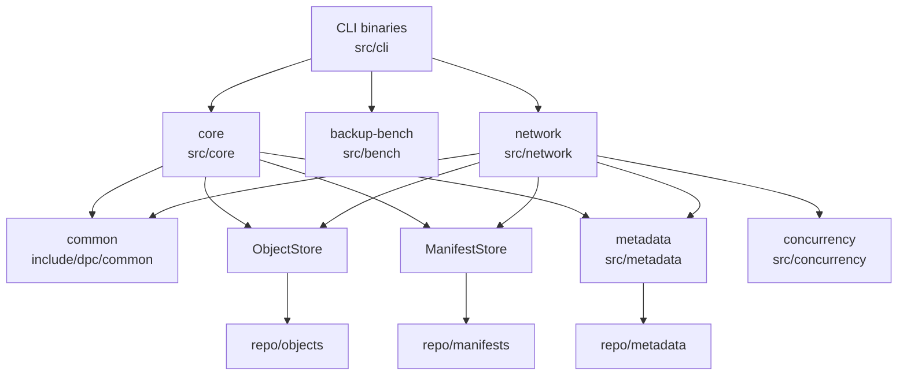

對應檔案：`src/cli/*`、`src/core/*`、`src/network/*`、`src/metadata/*`、`src/concurrency/*`。

## Data Flow Diagram

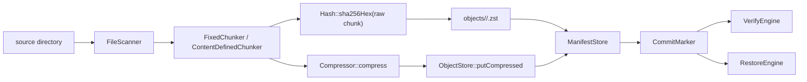

對應流程：`BackupEngine::create`、`VerifyEngine::verify`、`RestoreEngine::restore`。

## Create Backup Sequence Diagram

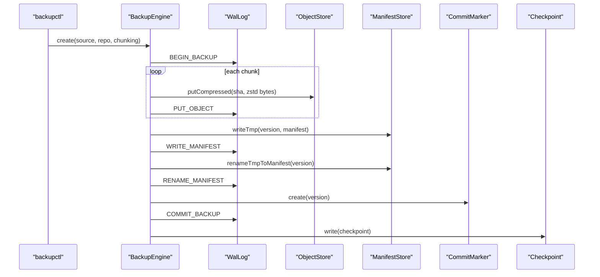

對應檔案：`src/core/BackupEngine.cpp`、`src/core/ObjectStore.cpp`、`src/core/ManifestStore.cpp`、`src/metadata/*`。

## Network Upload Sequence Diagram

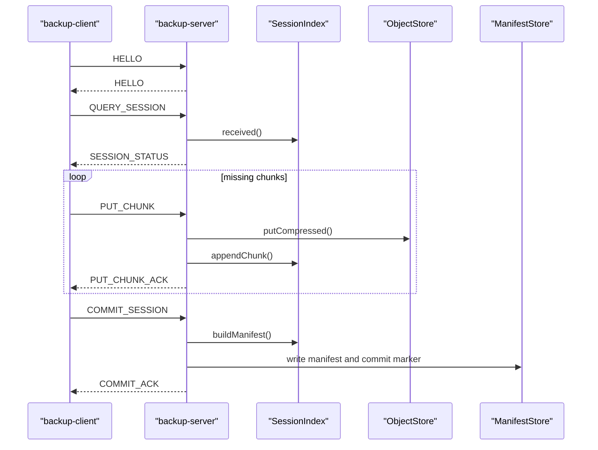

對應檔案：`src/network/BackupClient.cpp`、`src/network/BackupServer.cpp`、`src/network/SessionIndex.cpp`。

## Module Diagram

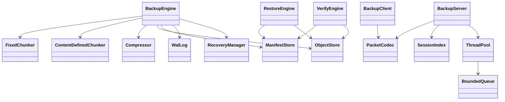

對應標頭：`include/dpc/core/*`、`include/dpc/metadata/*`、`include/dpc/network/*`、`include/dpc/concurrency/*`。

## Repository Layout Diagram

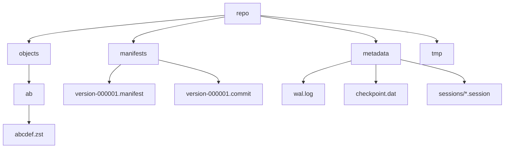

對應格式：[backup-format.md](backup-format.md)。

## CLI To Internal API Diagram

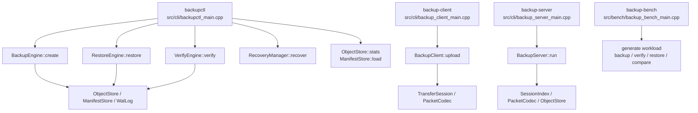

此圖描述 CLI binary 如何進入目前 C++ 類別 API。它對應 `src/cli/*`、`include/dpc/core/*`、`include/dpc/network/*` 與 `src/bench/backup_bench_main.cpp`。目前沒有 REST/gRPC API；這裡的 API 指 repository 內部 C++ 介面。

## Backup Implementation Detail

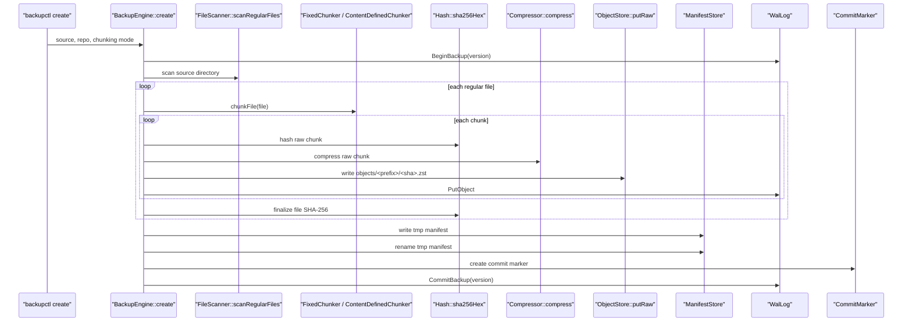

對應檔案：`src/core/BackupEngine.cpp`、`src/core/FileScanner.cpp`、`src/core/FixedChunker.cpp`、`src/core/ContentDefinedChunker.cpp`、`src/core/ObjectStore.cpp`、`src/core/ManifestStore.cpp`。

## Restore Safety Sequence

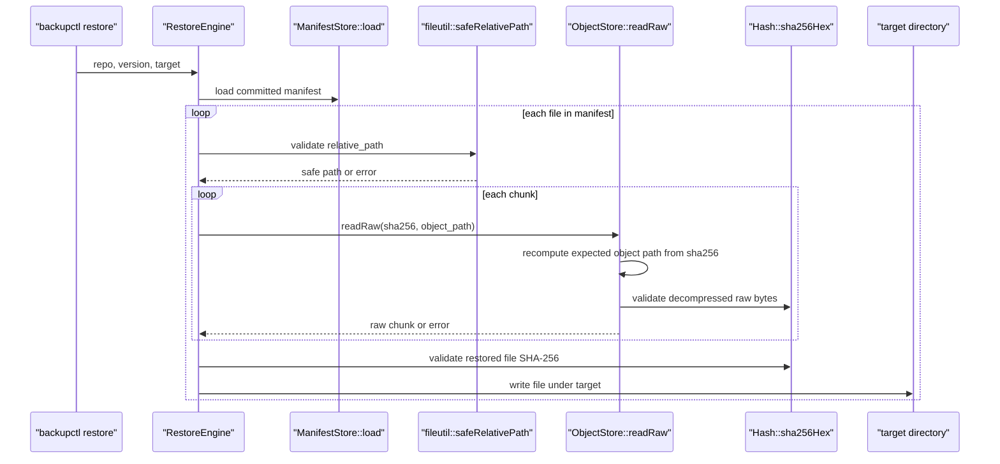

此圖對應 `src/core/RestoreEngine.cpp`、`src/core/ObjectStore.cpp`、`include/dpc/common/FileUtils.hpp`。manifest 內的 `relative_path` 與 `object_path` 都視為不可信輸入。

## Verify And Object Integrity Flow

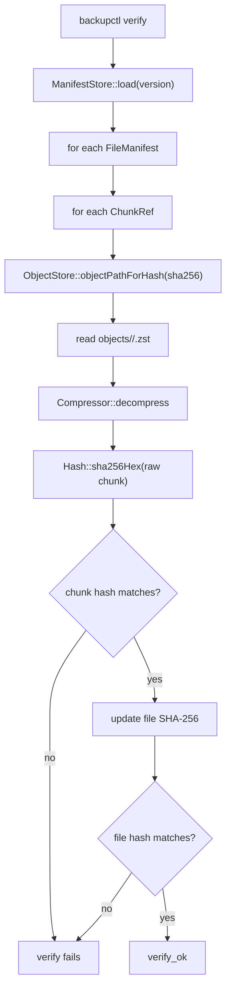

對應檔案：`src/core/VerifyEngine.cpp`、`src/core/ObjectStore.cpp`、`src/core/Compressor.cpp`、`include/dpc/common/Hash.hpp`。

## Packet Encode / Decode Flow

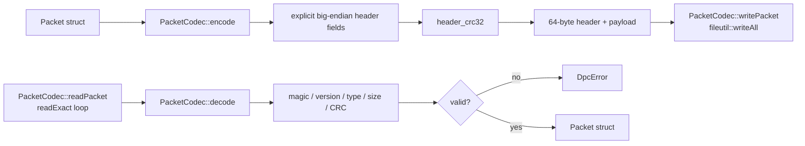

對應檔案：`src/network/PacketCodec.cpp`、`include/dpc/network/PacketCodec.hpp`。此流程避免直接把 C++ struct 寫到 socket，避免 padding、endianness 與 ABI 差異。

## Client / Server API Chain

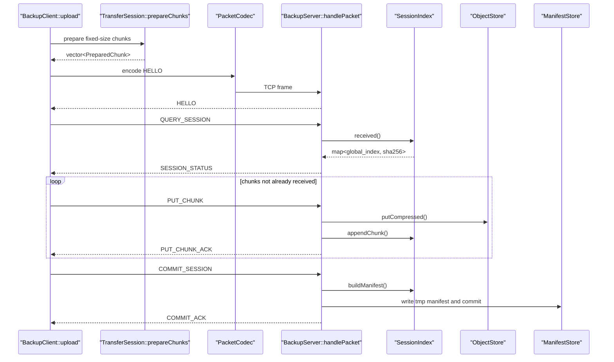

對應檔案：`src/network/BackupClient.cpp`、`src/network/BackupServer.cpp`、`src/network/TransferSession.cpp`、`src/network/SessionIndex.cpp`。client/server transfer 目前使用 fixed-size chunks。

## WAL Recovery Decision Flow

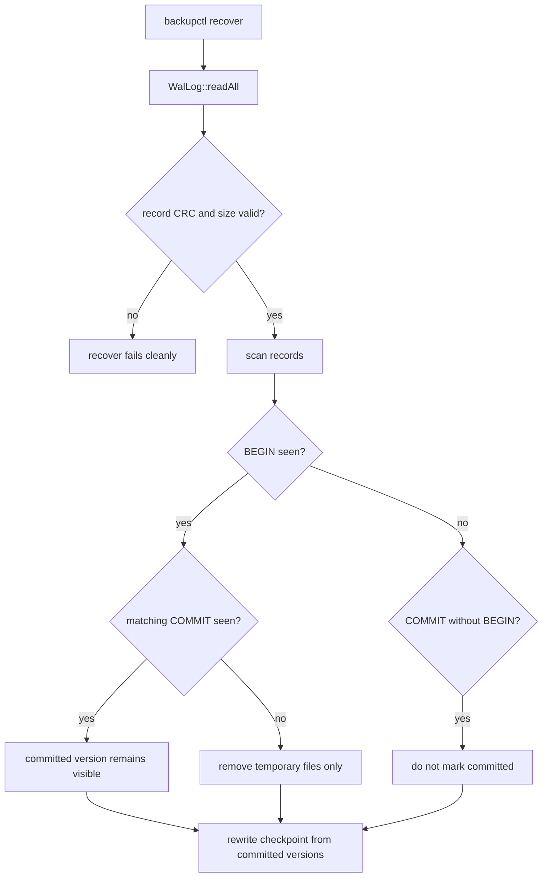

對應檔案：`src/metadata/WalLog.cpp`、`src/metadata/RecoveryManager.cpp`、`tests/unit/test_wal.cpp`、`tests/fault_injection/crash_recovery_test.sh`。

## Benchmark Correctness Gate

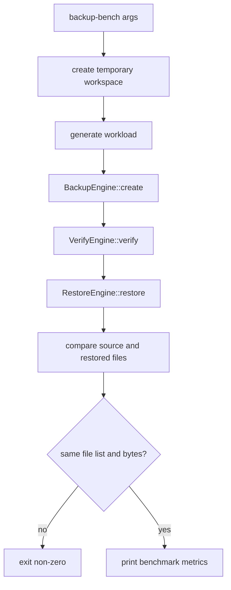

對應檔案：`src/bench/backup_bench_main.cpp`、`scripts/bench.sh`、[benchmark.md](benchmark.md)。
