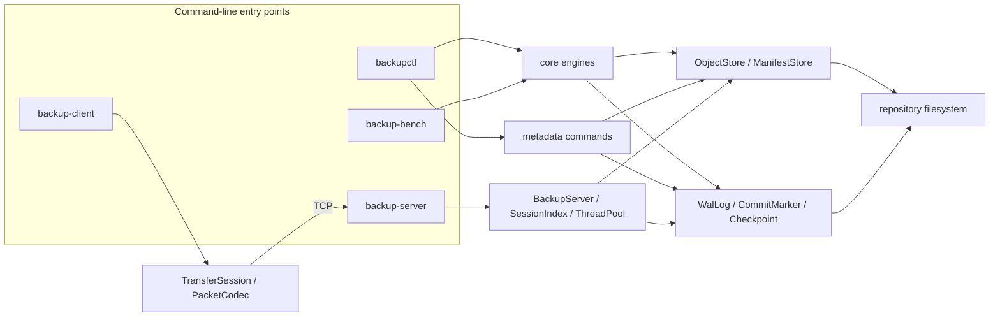
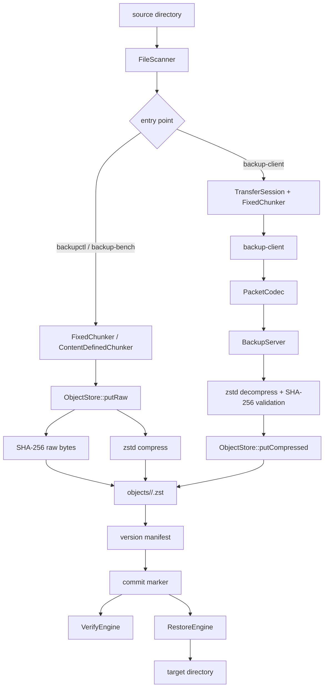
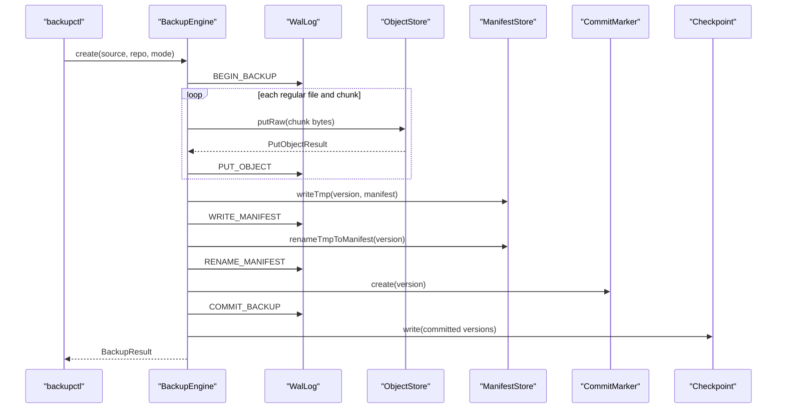
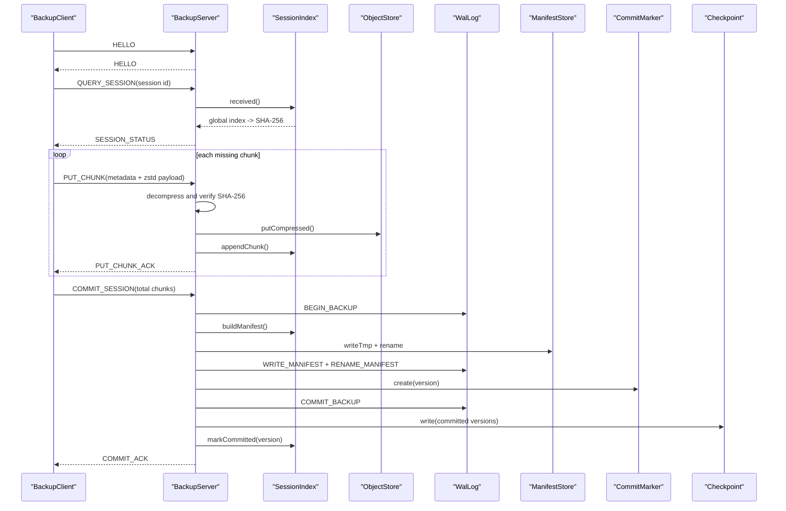
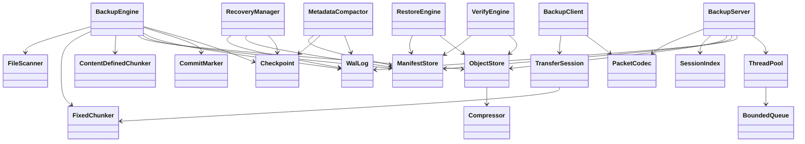
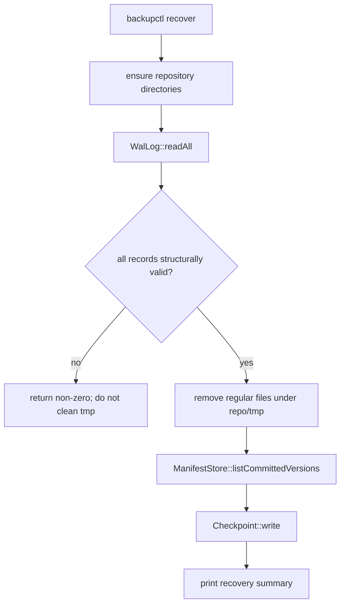
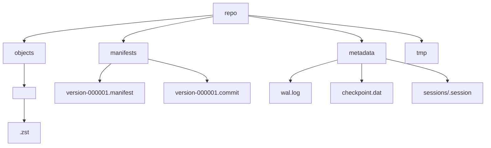

# 架構與流程圖

本文件的節點只包含目前程式碼、腳本與 repository 格式中存在的元件。

## 系統架構圖（System Architecture Diagram）

此圖對應 `src/cli/*`、`src/bench/backup_bench_main.cpp`、`src/core/*`、`src/network/*`、`src/metadata/*` 與 `src/concurrency/*`。`corrupt-repo` 未列入主要入口，因為它只在 WAL 尾端追加測試資料。

## 資料流圖（Data Flow Diagram）

本機路徑對應 `BackupEngine::create` 與 `ObjectStore::putRaw`。網路路徑對應 `TransferSession::prepareChunks`、`BackupClient::upload`、`BackupServer::handlePacket` 與 `ObjectStore::putCompressed`。

## 建立本機備份時序圖（Sequence Diagram）

此圖對應 `src/core/BackupEngine.cpp`、`src/core/ObjectStore.cpp`、`src/core/ManifestStore.cpp` 與 `src/metadata/{WalLog,CommitMarker,Checkpoint}.cpp`。`after-commit-marker` fault 會在 commit marker 建立後、`COMMIT_BACKUP` record 寫入前中止。

## 網路上傳時序圖

此圖對應 `src/network/BackupClient.cpp`、`src/network/BackupServer.cpp`、`src/network/SessionIndex.cpp`、`src/core/{ObjectStore,ManifestStore}.cpp` 與 metadata 模組。Client/server 上傳固定使用 `FixedChunker`。

## 模組關係圖（Module Diagram）

此圖對應 `include/dpc` 下各模組的標頭與 `src` 下的同名實作。`BackupEngine` 不呼叫 `RecoveryManager`；recovery 是獨立的 `backupctl recover` 命令。

## Recovery 流程圖

此圖對應 `src/metadata/RecoveryManager.cpp` 與 `src/metadata/WalLog.cpp`。Recovery 不依 WAL payload 重播 object 或 manifest 操作，也不依 `COMMIT_BACKUP` record 單獨建立可見版本。

## Repository 目錄圖

目錄與格式說明見 [backup-format.md](backup-format.md)。
