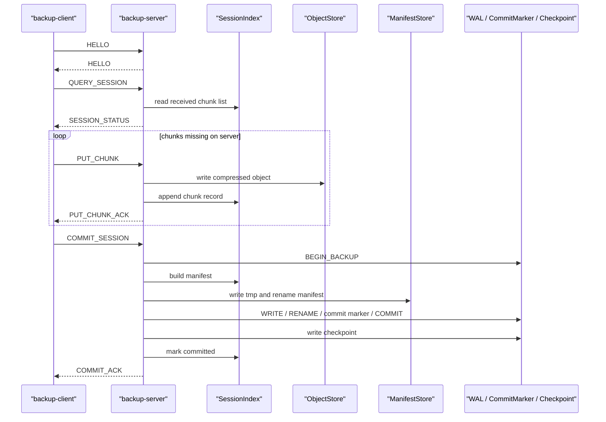

# 傳輸協定

Network layer 使用 blocking TCP socket 與自訂 binary packet。實作位於 `PacketCodec`、`BackupClient`、`BackupServer`、`TransferSession` 與 `SessionIndex`。Client 端固定使用 64 KiB `FixedChunker`。

目前沒有 HTTP、gRPC、TLS、authentication 或 authorization。

## Packet Header

`PacketCodec` 使用固定 64-byte header，欄位以 big-endian encode/decode，不直接傳送 C++ struct。

```text
magic:           uint32
version:         uint16
type:            uint16
session_id_hash: uint64
chunk_index:     uint64
payload_size:    uint32
header_crc32:    uint32
chunk_sha256:    32 bytes
```

限制：

```cpp
static constexpr std::uint32_t kMagic = 0x44504350;
static constexpr std::uint16_t kVersion = 1;
static constexpr std::size_t kHeaderSize = 64;
static constexpr std::uint32_t kMaxPayloadSize = 8 * 1024 * 1024;
```

`header_crc32` 只檢查 header。PUT_CHUNK payload 內的 chunk 內容會用 SHA-256 驗證。

## Packet Types

| Type | 用途 |
| --- | --- |
| `HELLO` | client/server handshake |
| `QUERY_SESSION` | client 查詢 server 已收到的 chunk |
| `SESSION_STATUS` | server 回覆已收到 chunk index 與 SHA-256 |
| `PUT_CHUNK` | client 傳送壓縮 chunk 與 metadata |
| `PUT_CHUNK_ACK` | server 確認 chunk 寫入 |
| `COMMIT_SESSION` | client 要求建立 manifest 與 commit marker |
| `COMMIT_ACK` | server 回覆 committed version |
| `ERROR` | server 回覆錯誤訊息 |

## TCP Stream Handling

TCP 是 stream，`read`/`write` 不保證一次完成整個 packet。`PacketCodec::readPacket` 使用 read loop 先讀 64-byte header，再依 `payload_size` 讀 payload。`PacketCodec::writePacket` 使用 `fileutil::writeAll` 寫出整個 frame。

## 上傳流程



此圖對應 `src/network/BackupClient.cpp`、`src/network/BackupServer.cpp`、`src/network/SessionIndex.cpp`、`src/core/{ObjectStore,ManifestStore}.cpp` 與 metadata 模組。

## Error Handling

`PacketCodec::decode` 會拒絕：

- frame 小於 header size
- magic mismatch
- version mismatch
- payload size 超過 8 MiB
- frame size 與 payload size 不一致
- header CRC mismatch

`BackupServer` 也會檢查 PUT_CHUNK 中壓縮資料解開後的 raw SHA-256 是否等於 header 的 `chunk_sha256`。

## 目前限制

- TCP 連線沒有 TLS、authentication 或 authorization。
- `session_id_hash` 是 FNV-1a style 64-bit 值，用於 packet 欄位與回應，不是安全性識別；server 不會用它驗證 payload 中的 session id。
- Payload metadata 是專案內部文字格式，沒有獨立的 format version negotiation。
- Session index 使用 append-only 文字檔；commit 後只追加 `COMMITTED` record，不會清除檔案。
- Server 沒有 connection timeout、request size quota（除單一 packet 8 MiB 限制）或 rate limit。
